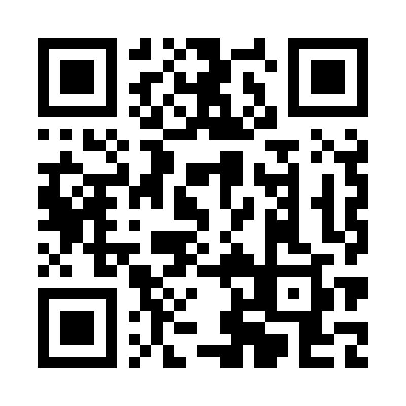

# 레코드룸 — 역설계 제작 프롬프트

> 지금 공개된 레코드룸(https://toddoward.github.io/record-room/)의 소스와 디자인에서 거꾸로 뽑아낸 **제작 지시서**다.
> 짧은 평문판은 [`PROMPT-BRIEF.md`](PROMPT-BRIEF.md). 아래 "프롬프트" 블록 전체를 코딩 에이전트(Claude Code · Google Antigravity 등)에 그대로 넣으면 같은 앱을 처음부터 만들고, GitHub Pages로 공개하고, README에 설명·주소·QR을 남긴다.
> 수치는 모두 실제 코드 값이다. `S` = 그림 캔버스 한 변(정사각) 길이.

---

## 프롬프트

```
너는 감성적인 한 페이지 웹앱을 만드는 프런트엔드 개발자이자 그래픽 디자이너야.
아래 명세대로 "레코드룸"을 만들고, GitHub에 공개 저장소로 올리고, GitHub Pages로 배포해 줘.
묻지 말고 끝까지 진행하고, 단계마다 무엇을 하는지 한국어로 한 줄씩 알려 줘.

━━━━━━━━━━━━━━━━━━━━━━━━━━━━━━━━━━━━━━━━
0. 무엇을 만드나
━━━━━━━━━━━━━━━━━━━━━━━━━━━━━━━━━━━━━━━━
- 이름: 레코드룸. 부제: "내 노래를 커버 · LP · 테이프로"
- 유튜브 영상·유튜브 재생목록·MP3 파일을 틀어 주는 음악 플레이어.
  커버 사진 한 장으로 화면 전체의 색을 맞추고, 같은 곡을 세 가지 모습(앨범 커버 / 도는 LP / 감기는 카세트)으로 보여 준다.
- 성격: 장난감이 아니라 "감성적이면서 실제로 쓸 만한" 앱. 작업하며 틀어 두거나, 모니터에 띄워 방 분위기를 꾸미는 용도.

━━━━━━━━━━━━━━━━━━━━━━━━━━━━━━━━━━━━━━━━
1. 산출물 규칙
━━━━━━━━━━━━━━━━━━━━━━━━━━━━━━━━━━━━━━━━
- index.html 한 파일(HTML·CSS·JavaScript). 빌드 도구·프레임워크·외부 라이브러리·CDN·웹 글꼴·이미지 파일 금지.
  예외는 유튜브 재생 도구 https://www.youtube.com/iframe_api 하나.
- 한국어 UI. 글꼴: system-ui, -apple-system, "Apple SD Gothic Neo", "Pretendard", "Malgun Gothic", sans-serif.
- 휴대폰 세로 화면이 기준, PC에서는 가운데 정렬. 터치·마우스·키보드 모두 동작.
- <meta name="viewport" content="width=device-width,initial-scale=1,viewport-fit=cover">,
  <meta name="referrer" content="strict-origin-when-cross-origin">(유튜브 삽입 재생에 필요), theme-color는 배경색과 함께 바꾼다.
- 개인정보: MP3·사진은 기기를 떠나지 않는다. 서버 없음.

━━━━━━━━━━━━━━━━━━━━━━━━━━━━━━━━━━━━━━━━
2. 디자인 원칙
━━━━━━━━━━━━━━━━━━━━━━━━━━━━━━━━━━━━━━━━
- 평평한 면(flat) + 층마다 아주 부드러운 그림자. 장식용 그라데이션·광택·테두리를 늘리지 않는다.
  그림 속 그림자는 하나의 함수로 통일: soft(k) = 그림자색 rgba(0,0,0,0.22·k), 흐림 S·0.035·k, 아래로 S·0.01·k.
- 색은 전부 커버 사진에서 온다(3장). 고정 색은 그림 소품(판·톤암·카세트 몸체)에만.
- 움직임은 느리고 부드럽게: 배경 빛 26~35초 왕복, 판 0.3바퀴/초, 색 전환 1.2~1.6초.

[색 토큰 — CSS 변수, 기본값]
--bg #1f2329 (배경) · --fg #eef1f4 (주 글자·재생 버튼) · --sub 주 글자의 62~65% 불투명 · --track 주 글자의 15~25%
--accent (켜진 상태 표시) · --c1..--c4 (앰비언트 빛 4개)

[배치 — 세로 한 줄, 최대 폭 460px, 좌우 여백 22px, 위·아래는 safe-area 포함 14px/24px]
1) 윗줄: 왼쪽 재생목록 버튼(44px 원) · 가운데 모드 전환(커버 | LP | 테이프, 알약 모양 99px 반경,
   바탕 = 주 글자 10% 섞음, 켜진 칸 = --fg 바탕에 --bg 글자, 14px/600) · 오른쪽 ＋ 버튼
2) 그림 무대: 정사각, 위 20px · 아래 14px, 좌우로 6px 넓게. <canvas> 하나(기기 배율 최대 2)
3) 제목 22px/700, 자간 -0.02em, 한 줄 말줄임 · 가수 15px --sub, 위 4px
4) 진행 막대: 높이 4px 둥근 막대, 지난 부분 --fg, 남은 부분 --track, 손잡이 14px 원 · 아래 시간 12px 숫자 고정폭
5) 조작 줄(양끝 정렬): 순서(섞기) · 이전 · 재생/정지(72px 원, --fg 바탕) · 다음 · 반복
   순서·반복 버튼은 꺼지면 --sub, 켜지면 --accent + 아래 4px 점. 한 곡 반복이면 아이콘 가운데 작은 "1"
6) 소리 크기: 스피커 아이콘 20px + 막대(기본 50%, 기억)
7) 칩 두 개(반반, 14px 반경, 주 글자 10% 바탕): "지금 섞기" · "움직이는 카드 저장"
- 아래에서 올라오는 판(시트): 위쪽 24px 둥글게, 바탕 = --bg 88% + 흰색 12%, 손잡이 막대 40×5px, 뒤 화면은 35% 어둡게.
  ① 노래 넣기 ② 재생 목록(제목 줄 오른쪽에 "모두 지우기") ③ 움직이는 카드
- 알림(토스트): 아래 가운데 알약, --fg 바탕 --bg 글자 14px/600, 2.4초
- 빈 목록일 때: 제목 "레코드룸", 가수 자리 "오른쪽 위 ＋ 버튼 또는 재생 버튼". 그림 위에 글을 겹치지 않는다.
  재생 버튼을 누르면 노래 넣기 판이 열린다.

[앰비언트 배경]
- 화면 뒤 고정 층(inset -25%), blur 80px, 전체 불투명 0.5. 지름 60vmax 원 4개에 --c1..--c4.
  각자 26·31·29·35초 동안 다른 방향으로 18~24vmax 이동·0.85~1.2배 확대를 왕복(ease-in-out, alternate). 4번째는 0.35로 더 옅게.

━━━━━━━━━━━━━━━━━━━━━━━━━━━━━━━━━━━━━━━━
3. 색 뽑기 — trackpic과 같은 절차 (그대로 지킬 것)
━━━━━━━━━━━━━━━━━━━━━━━━━━━━━━━━━━━━━━━━
입력: 커버로 쓰는 정사각 영역.
1) 가운데 70%만 잘라 읽는다. 4픽셀마다 하나, 불투명도 125 이상만.
2) MMCQ(중앙값 자르기): RGB 각 5비트 히스토그램(32768칸) → 픽셀이 가장 많은 상자부터, 가장 긴 축의 누적 절반 지점에서 둘로 자르기를
   25색이 될 때까지(반복 상한 max(100, 색 수×3)). 상자 평균색, 픽셀 수 많은 순.
3) 주색 = 첫 색의 색상(h). 채도 < 0.2 이거나 색상 거리 ≤ 0.15인 색만 후보(5개 미만이면 전부).
4) 후보를 밝기(0.2126R+0.7152G+0.0722B) 오름차순 → 서로 밝기 차가 25 이상인 것만 골라 5색. 모자라면 15→8→5→3으로 낮춘다.
   그래도 모자라면 첫 색의 색상·채도로 밝기만 다르게(±0.16씩) 채운다. 다시 밝기 오름차순 5색 = 팔레트.
5) 적용: --bg = 가장 어두운 색. 배경 밝기 > 180이면 글자 #2C3236 계열, 아니면 #EDF1F3 계열(--sub·--track도 같은 계열의 투명도).
   --c1..--c4 = 나머지 4색. --accent = 배경과 밝기 차가 가장 큰 색을, 색상은 두고 밝기만 옮겨 배경 대비 3:1 이상으로.
6) 카세트 스티커용은 따로:
   - 종이색: 주색의 색상, 채도 = 원래의 절반(0.12~0.32), 밝기 0.93 → 주색을 아주 옅게 띤 크림색
   - 띠 3색: 25색 가운데 채도 ≥ 0.28, 밝기 0.22~0.82인 색을 색상 거리 0.045 이상 벌어지게 3개
     (모자라면 첫 색 색상 ±0.07씩). 채도 0.5~0.78, 밝기 0.5~0.66으로 맞춘다.
     채도 있는 색이 하나도 없는 흑백 사진이면 지어내지 말고 무채색 3단(밝기 0.32 · 0.55 · 0.76).
- 유튜브 썸네일은 i.ytimg.com(교차 출처 허용)에서 crossOrigin="anonymous"로 읽는다.
  maxresdefault를 먼저, 폭 200 이하(없을 때의 회색 그림)면 hqdefault의 위아래 검은 띠(12.5%씩)를 뺀 가운데 정사각.

━━━━━━━━━━━━━━━━━━━━━━━━━━━━━━━━━━━━━━━━
4. 그림 세 가지 (한 캔버스, 같은 함수를 화면과 저장에 함께 쓴다)
━━━━━━━━━━━━━━━━━━━━━━━━━━━━━━━━━━━━━━━━
[커버] 여백 S·0.07, 모서리 S·0.035, 그림자 rgba(0,0,0,.35) 흐림 S·0.07 아래 S·0.03. 커버가 없으면 팔레트 2→4번 대각 그라데이션 + 가운데 "♪".

[LP] 판은 가운데: 중심 (S·0.5, S·0.49), 반지름 R = S·0.38. 커버(라벨) 반지름 = R·0.5 — 반지름으로 커버 : 검은 판 = 1 : 1.
- 판: 그림자 rgba(0,0,0,.45) 흐림 S·0.06 · 방사 그라데이션 #1b1b1e → #121214(60%) → #0a0a0b
- 소리골: 라벨의 1.12배부터 R·0.975까지 R·0.0115 간격 원, 흰색 3.5~5.9% 불투명, 굵기 max(0.5, S·0.0012)
- 빛 반사: 원뿔 그라데이션(시작 -45°)로 흰색 13%·9% 띠 두 줄 — 판이 돌아도 반사는 제자리
- 라벨 = 커버 사진을 원으로 잘라 판과 함께 회전, 테두리 rgba(0,0,0,.35) · 가운데 축 R·0.028 #d8d8d8
- 회전: 재생 중 0.3바퀴/초. 시작은 부드럽게 붙고(가속 1.6/초), 멈추면 금방 그 자리에 선다(감속 5/초)
- 톤암(평평한 흰색 + 부드러운 그림자):
  받침 중심 (S·0.1, S·0.87) — 바깥 원 S·0.062 #e3e3e0, 안 원 S·0.03 #f4f4f2.
  팔: 받침에서 위로 올라가다 끝에서 오른쪽으로 살짝 꺾이는 S자 곡선, 굵기 S·0.016, 둥근 끝, #f4f4f2,
      팔 길이 L = S·0.41 (로컬 좌표 위쪽이 -y: 곡선 (0,0) → 제어점 (-S·0.03,-S·0.16),(-S·0.01,-L·0.72) → (S·0.025,-L·0.88) → 직선 (S·0.045,-L·0.93)).
  헤드셸: (S·0.05, -L·0.95)에서 0.5rad 기울인 둥근 사각 S·0.044×S·0.08, 안쪽에 어두운 홈 두 줄. 받침 반대쪽 짧은 꼬리(균형추).
  각도: "재생" = 바늘이 판 바깥 홈(중심에서 왼쪽 R·0.8, 위 R·0.12)을 가리키는 각, "멈춤" = 그보다 0.42rad 바깥.
  재생하면 판 위로 올라가고, 멈추면 바깥으로 내려온다(초당 3.2 비율로 부드럽게).

[카세트] 몸체 폭 W = S·0.9, 높이 H = W·0.63, 가운데(살짝 위 S·0.02), 모서리 W·0.028.
- 몸체: 무광 #1b1b20, soft(0.6). 가로 결 = W·0.0125 간격으로 굵기 W·0.0038 흰색 3.5% 줄. 안쪽 얇은 테 흰색 6%.
- 스티커: x W·0.055, y H·0.1, 폭 W·0.89, 높이 H·0.6, 모서리 S·0.01, 종이색(3장 6).
  왼쪽 30%에 커버 사진 → 사진 폭의 45~105% 구간에서 종이색으로 번진다.
  레트로 띠 3색 = 창 뒤를 스티커 오른쪽 끝까지 가로지르는 가로 띠: 굵은 띠(스티커 높이 37~67%) · 얇은 띠(68~74%) · 얇은 띠(75~81.5%).
  왼쪽 끝은 사진이 번지는 같은 구간(사진 폭 45~105%)에서 투명 → 불투명으로 번져 나온다.
  글자 칸(스티커 위 가장자리 ~ 띠 시작 37%)을 가는 줄 두 개(글자색 28% 불투명, 굵기 S·0.0016)로 3등분:
  맨 윗칸은 여백, 제목은 둘째 줄 위에, 가수는 띠 바로 위에 앉는다(글자 바닥선 = 줄 − 스티커 높이 2.8%).
  글자(#2a2a30): 제목 700, H·0.062 · 가수 600, H·0.04, 62% 불투명(크기·굵기·농도로 위계) · 아래 "Normal Bias 120μs EQ" 600, H·0.042 · 오른쪽 아래 "A|60" 800, H·0.08.
  글자와 줄은 사진 폭 102% 지점부터 스티커 폭 96.5%까지, 넘치면 말줄임.
- 창: 스티커 가운데, 폭 56% · 높이 40%, 위치 스티커 높이 40%부터. 검은 #0c0c0e, soft(0.35).
  가운데 투명창(창 폭 38%)으로 테이프 뭉치가 보인다: 갈색 #2b1f18 원 두 개, 반지름이 재생 진행에 따라
  왼쪽은 작아지고(최대→최소) 오른쪽은 커진다(최소 = 창 높이 26%, 최대 = 창 폭 30%).
  릴 두 개: 바깥 원 #d9d8d4, 안 원 = 팔레트 가운데 색, 흰 이빨 6개가 재생 중 회전, 가운데 검은 구멍.
- 아래 사다리꼴(위 H·0.76, 아래 폭 W·0.17~0.83, 위 폭 0.22~0.78) #16161a + 같은 가로 결(조금 진하게 4.5%).
  구동 구멍 4개 = "뚫린 구멍"(번쩍이는 단추 아님): 배경색으로 채워 뒤가 보이게, 위쪽 안벽 그늘 + 아래 모서리 흰색 10% 선.
  바깥 둘 (폭의 27%·73%, 높이 94.8%, 반지름 W·0.023), 안쪽 둘 (36.5%·63.5%, 92.5%, W·0.017).
- 나사 5개(네 모서리 + 아래 가운데 위): 반지름 W·0.014 #2c2c32에 검은 십자.

━━━━━━━━━━━━━━━━━━━━━━━━━━━━━━━━━━━━━━━━
5. 기능
━━━━━━━━━━━━━━━━━━━━━━━━━━━━━━━━━━━━━━━━
[노래 넣기]
- 유튜브 주소에서 영상 ID(v=, youtu.be/, shorts/, embed/, live/의 11자)와 재생목록 ID(list=)를 뽑는다. list가 있으면 재생목록을 통째로.
- 재생목록: 화면 밖 두 번째 YT.Player에 playerVars {list, listType:'playlist'}로 열고 getPlaylist()가 나올 때까지 0.5초마다(최대 8초) 확인 → ID 목록 추가 → 그 플레이어는 없앤다.
- 제목·가수: https://www.youtube.com/oembed?format=json&url=… (교차 출처 허용) → title, author_name. 재생 중이면 getVideoData()로 보충.
- MP3(여러 개): 앞 2MB에서 ID3v2(2.3/2.4) 직접 읽기 — TIT2 제목, TPE1 가수, APIC 커버(인코딩 0·3은 단일 널, 1·2는 2바이트 널 처리). 없으면 파일 이름.
[재생]
- 유튜브: 화면 밖(위치 -480px) 240×135 YT.Player, playerVars {playsinline:1, controls:0, rel:0, disablekb:1, origin: 현재 출처}. MP3: Audio 요소. 하나의 재생 인터페이스(play·pause·seek·time·duration)로 감싼다.
- 순서: 순서대로 / 섞어서(현재 곡을 맨 앞에 둔 피셔-예이츠). 반복: 끔 → 전체 → 한 곡. "지금 섞기" = 섞기 켜고 다른 곡으로 바로.
- 이전: 3초 넘게 들었으면 처음으로, 아니면 이전 곡. 스페이스 = 재생/정지, ←/→. 잠금 화면 조작(Media Session) + 곡 정보.
- 소리 크기: Audio.volume과 yt.setVolume을 함께, 기본 50, 기억.
[오류]
- 빈 플레이어가 내는 오류(목록이 비었을 때)는 무시.
- file://로 열었으면 "내 컴퓨터 파일로 열면 유튜브가 재생을 막습니다 — 인터넷 주소로 열어 주세요"만 알리고 곡을 막힘으로 표시하지 않는다.
- 101·150 = 다른 사이트 재생 금지 → 목록에 흐리게 "다른 사이트 재생이 막힌 영상", 다음 곡으로. 가수가 "… - Topic"(유튜브 뮤직 자동 음원)이면 그렇다고 알려 준다(몇 초 재생 뒤 멈추는 경우가 많다).
  모든 곡이 막혔으면 넘기기를 멈춘다.
[기억] localStorage 접두어 "rr-": 유튜브 곡(id·제목·가수), 모드, 순서, 반복, 소리. MP3는 기억하지 않는다. 모든 접근은 try/catch.
[재생 목록 판] 작은 썸네일 46px · 제목·가수 · 현재 곡은 --accent · 곡마다 ✕ · 위쪽 "모두 지우기"(확인 창 후 비우기).
[움직이는 카드 저장]
- 세로 9:16 카드에 지금 모드 그대로: 배경색 + 나머지 4색의 둥근 빛이 한 바퀴 돌며 움직임 · 그림(S = 카드 폭 86%, 위 10%) · 제목·가수 · 진행 막대·시간.
- 48장, 4초(장당 83ms) 반복. LP는 한 바퀴, 릴은 두 바퀴, 톤암은 재생 위치.
- 형식: 브라우저가 WebP를 만들 수 있는지 직접 시험(canvas.toDataURL('image/webp')가 webp로 나오는지 — 기기 이름으로 판단하지 않는다).
  ① WebP(가능할 때 기본): 720×1280, 장마다 toDataURL webp(품질 0.86) → RIFF 안의 VP8/VP8L/ALPH 덩어리를 꺼내
     VP8X(애니메이션 플래그 0x02, 알파 있으면 0x10) + ANIM(반복 무한) + 장마다 ANMF(지속 83ms, 섞지 않음 0x02)로 직접 묶는다.
  ② GIF(아이폰·아이패드 Safari 등 WebP를 못 만들 때는 이것만): 360×640, 전체 팔레트 256색 = 회색 사다리 24단 + MMCQ 232색
     (흰 글씨·검은 판이 회색으로 뭉개지지 않게), 15비트 색 캐시로 가장 가까운 색, LZW(코드 크기 증가 규칙 omggif와 동일), NETSCAPE 무한 반복, 장당 8/100초.
- 만든 뒤 미리보기 + "공유하기"(navigator.share({files}) 지원 시 휴대폰 공유 창 → 카카오톡·인스타그램 등 선택) · "저장하기"(내려받기).
  공유는 사용자가 누른 순간에 호출한다(만드는 동안의 대기 뒤에 바로 호출하지 않는다).

━━━━━━━━━━━━━━━━━━━━━━━━━━━━━━━━━━━━━━━━
6. 확인 (만든 뒤 직접)
━━━━━━━━━━━━━━━━━━━━━━━━━━━━━━━━━━━━━━━━
- 주소 뒤 #v=<영상ID>&mode=cover|lp|tape 로 미리 넣고 띄우는 개발용 진입을 둔다.
- 헤드리스 Chrome으로 세 모드를 500×980으로 찍어 눈으로 본다: 그림이 무대 안에 있는가, 글자가 겹치지 않는가, 빈 목록 문구.
- 저장 결과는 Pillow 등으로 열어 장 수(48)와 첫 장 색을 확인한다.
- 유튜브 재생은 file://에서 막히므로 공개 주소에서 확인한다(재생 상태 1, 시간이 흐르는지).

━━━━━━━━━━━━━━━━━━━━━━━━━━━━━━━━━━━━━━━━
7. 배포
━━━━━━━━━━━━━━━━━━━━━━━━━━━━━━━━━━━━━━━━
Pages 주소는 계정 이름과 저장소 이름으로 미리 정해진다. 그래서 QR과 README를 먼저 만들고, 한 번에 올린다(열릴 때까지 기다리지 않는다).
1) {owner} = gh api user -q .login → 배포 주소 = https://{owner 소문자}.github.io/record-room/
2) QR: segno로 그 주소를 오류 정정 M으로 만들고, 800×800 흰 바탕 가운데 651×651 코드(사방 여백 74px, 순수 흑백)로 qr.png 저장.
   zxing-cpp로 다시 읽어 주소가 그대로 나오는지 확인한다.
3) README.md에 반드시 함께 넣는다(아래 목록).
4) 새 폴더 record-room에 index.html · README.md · qr.png · .gitignore · .gitattributes(* text=auto eol=lf)
   → git init -b main → 커밋 한 번 → gh repo create record-room --public --source . --push --description "내 노래를 앨범 커버 · LP · 카세트로 — 한 페이지 음악 플레이어"
5) GitHub Pages: gh api -X POST repos/{owner}/record-room/pages -f "source[branch]=main" -f "source[path]=/"
6) 끝. 공개 주소와 QR을 화면에 크게 띄우고 "첫 공개는 1~2분 뒤 열립니다"라고 알린다.

[README.md 내용]
   - 제목 "레코드룸"과 한 줄 소개
   - 배포 주소 링크 https://{owner}.github.io/record-room/ 와 그 QR 이미지  (폭 200px 정도)
   - 저장소 설명: 무엇을 하는 앱인지, 할 수 있는 것(넣기·세 화면·재생 순서와 반복·소리·움직이는 카드 저장과 공유)
   - 알아 둘 것: 파일은 기기 밖으로 나가지 않음, 다른 사이트 재생이 막힌 영상(특히 "- Topic" 자동 음원)은 건너뜀, file://로 열면 유튜브가 막음, 아이폰은 GIF로 저장
   - 만든 계기: 색 뽑기는 trackpic(https://github.com/pic-kn/trackpic)과 같은 절차를 다시 작성, LP는 캔따개 플레이리스트(https://github.com/dearlovedive/playlist)에서 영감
```

---

## 이 프롬프트를 쓰는 곳

- **3회차 마술쇼** — 쇼에서는 짧은 문장 한 줄을 읽고, 이 명세는 쇼 폴더의 "미리 알려 둔 규칙"(CLAUDE.md) 자리에 둘 수 있다
- **다시 만들기·고치기** — 이 저장소를 다른 에이전트에게 맡길 때의 기준서. 코드와 이 문서가 다르면 코드가 기준이고, 이 문서를 고친다
