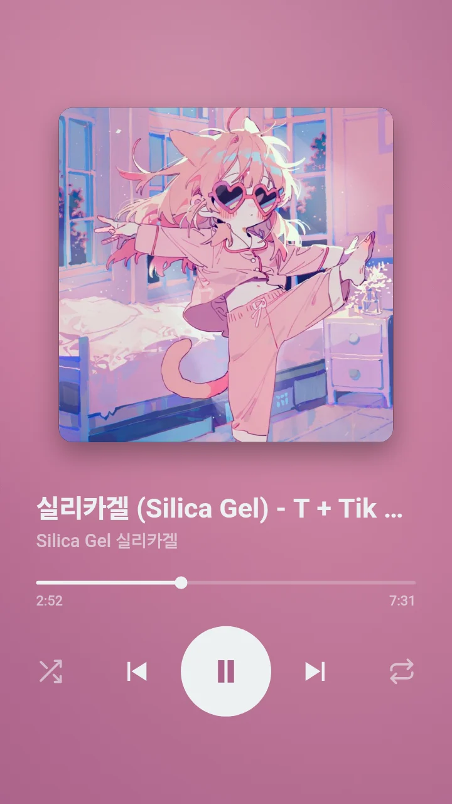
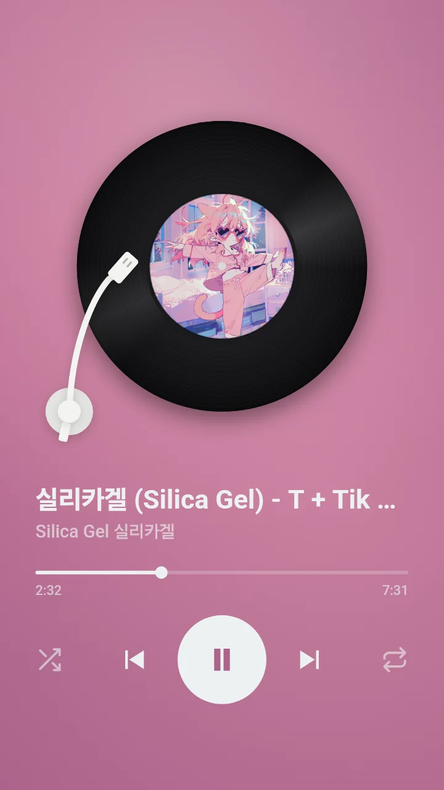
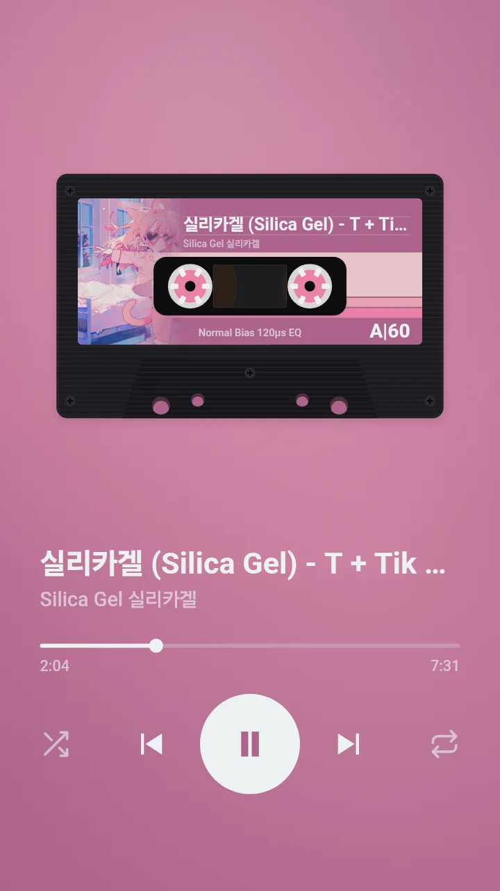

# 레코드룸 (Record Room)

**내가 고른 노래를, 내 사진을 앨범 커버로 씌워, 커버 · LP · 카세트테이프 플레이어로 듣습니다.**

익숙하다 못해 질리는 스트리밍 앱 화면 대신, 나만의 재생목록과 나만의 앨범 커버, 나만의 재생 화면으로 음악을 듣는 한 페이지 플레이어입니다. 듣고 있는 순간은 움직이는 카드로 저장할 수 있습니다.

**▶ 바로 열기 → https://toddoward.github.io/record-room/**

<table>
  <tr>
    <th width="33%">커버</th>
    <th width="33%">LP</th>
    <th width="33%">카세트</th>
  </tr>
  <tr>
    <td width="33%"></td>
    <td width="33%"></td>
    <td width="33%"></td>
  </tr>
</table>

위 세 장면은 모두 레코드룸의 ‘움직이는 카드 저장’으로 만들었습니다.

---

## 핵심 가치

- **나만의 재생목록** — 유튜브 영상, 유튜브 재생목록, MP3 파일을 한 목록에
- **내 사진이 앨범 커버** — 어떤 사진이든 커버로, 화면 전체도 그 사진의 색으로
- **나만의 재생 화면** — 커버 · 돌아가는 LP · 카세트테이프 중 선택
- **지금 이 순간을 저장** — 듣고 있는 화면을 4초짜리 움직이는 카드로 저장하고 휴대폰에서 바로 공유

## 기능

### 1. 플레이어 세 가지

| 플레이어 | 화면 |
|---|---|
| **커버** | 커버에서 뽑은 색으로 화면 전체를 맞추고, 나머지 색은 배경에 은은하게 흐름 |
| **LP** | 판이 돌고, 재생하면 톤암이 판 위로 내려오고, 멈추면 제자리로 돌아감 |
| **카세트** | 사진이 담긴 스티커와 사진 색의 레트로 띠. 릴이 돌고, 재생 시간에 따라 테이프 두께가 바뀜 |

### 2. 노래 넣기

- **유튜브 영상 주소** — 커버와 색은 영상 썸네일에서
- **유튜브 재생목록 주소** (`list=…`) — 주소 하나로 재생목록 전체 추가
- **MP3 파일** — 파일 안에 든 제목 · 가수 · 커버 그림을 그대로 사용

### 3. 내 커버 사진

- 사진을 올리거나 사진 주소를 넣으면 **모든 노래**의 커버가 그 사진으로, 화면 색도 그 사진에서
- **＋** 창에서 설정하며, 바꾸거나 **기본 커버로**를 누르기 전까지 유지

### 4. 움직이는 카드

- 지금 화면을 **4초짜리 움직이는 WebP**로 저장 (WebP를 만들 수 없는 브라우저, 예: 아이폰 · 아이패드 Safari는 GIF로)
- 카드에 조작 버튼 표시 여부 선택 (기본은 표시 안 함, 마지막 선택 기억)
- 휴대폰 공유 창으로 바로 보내기, 또는 기기에 내려받기

### 5. 재생

- 순서대로 / 섞어서, 반복 끔 / 전체 / 한 곡, **지금 섞기**, 소리 크기
- 키보드: `Space` 재생 · 일시정지, `←` `→` 이전 · 다음 곡
- 휴대폰 잠금 화면에서 조작

## 바로 시작하기

1. **https://toddoward.github.io/record-room/** 를 엽니다 (휴대폰이라면 맨 위 QR을 카메라로 찍어도 됩니다)
2. 오른쪽 위 **＋** 를 눌러 유튜브 주소, 재생목록 주소, MP3 파일을 넣습니다
3. 위쪽에서 **커버 / LP / 테이프** 중 하나를 고르고, 원하면 ＋ 창에서 **내 커버 사진**을 설정합니다
4. **움직이는 카드 저장**으로 지금 순간을 남깁니다

## 알아 둘 것

- **개인정보** — MP3와 올린 사진은 이 기기 밖으로 나가지 않습니다
- **저장되는 것** — 넣은 유튜브 곡, 내 커버 사진, 설정은 이 브라우저에 저장됩니다. MP3는 다시 열면 새로 넣어야 합니다
- **재생되지 않는 영상** — 영상 주인이 다른 사이트에서의 재생을 막아 둔 영상은 건너뜁니다
- **“… - Topic” 음원** — 유튜브 뮤직 자동 음원은 몇 초 뒤 멈추는 경우가 많습니다. 공식 뮤직비디오나 다른 업로드를 넣어 주세요 (유튜브 프리미엄 여부와는 무관합니다)
- **사진 주소로 커버 넣기** — 사진 서버가 다른 사이트의 읽기를 막으면 이미지 중계 서비스 [wsrv.nl](https://wsrv.nl)을 거쳐 가져옵니다 (이때 사진 주소가 wsrv.nl에 전달됩니다)
- **웹 주소로 열기** — 내 컴퓨터의 파일(`file://`)로 열면 유튜브가 재생을 막습니다

## 개발자용

- `index.html` — 앱 전체 (파일 하나, 외부 라이브러리 없음 — 유튜브 재생 도구만 사용)
- `assets/` — README 화면 이미지 · `qr.png` — 사이트 주소 QR
- `main`에 푸시하면 GitHub Pages로 바로 공개

## 참고

- 커버 색 추출은 [trackpic](https://github.com/pic-kn/trackpic)과 같은 절차(가운데 70% · 중앙값 자르기 25색 · 주색에 가까운 색 · 밝기순 5색)로 다시 구현했습니다
